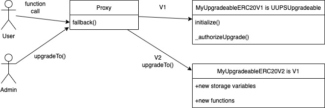

# Simple UUPS (EIP-1822) Upgrade pattern example using Openzeppelin

##### In this repo you can find a simple example of implementing the upgrading pattern EIP-1822 Universal Upgradeable Proxy Standard using Openzeppelin Upgradeable contracts library + Hardhat.
#

> Similarly to the TransparentUpgradeableProxy Pattern, UUPS relies on implementing a Proxy contract and using delegatecall+fallback to forward function calls to the Implementation contract and execute in the context of the Proxy. 
#
> One of the main differences between TransparentProxy and UUPS is their implementation of the admin of the proxy contract & how the admin updates the Implementation address. In TransparentProxy the proxy admin is located in a seperate ProxyAdmin contract thats authorized to update the Implementation address while in UUPS the Proxy Admin is implemented in the Implementation contract and the Implementation contract is responsible for setting authorizations to update the Implementation address. 
#
> While this is a downside of the UUPS Pattern the benefit is that UUPS reduces the cost of proxy function calls because the Proxy contract no longer has to check upon every call whether msg.sender is equal to the admin address kept in storage and as we know storage read/writes are some of the most expensive operations in a transaction.
#
> Openzeppelin allows you to extend their UUPSUpgradeable.sol contract which contains an 'upgradeTo()' function that is used to update the implementation address. This function calls UUPSUpgradeable.sol internal function _authorizeUpgrade() function that you need to include in your implementation contracts and set authorizations on. This function is crucial for implementing the UUPS pattern. Additionally Openzeppelins @openzeppelin/hardhat-upgrades tools enforce rules when deploying & upgrading implementation contract versions such as incorrect storage layout.
#
> Similarly to OZ TransparentUpgradeableProxy the previous deployments of your Proxy & Implementation contracts are kept in .openzeppelin so do not delete this directory.

